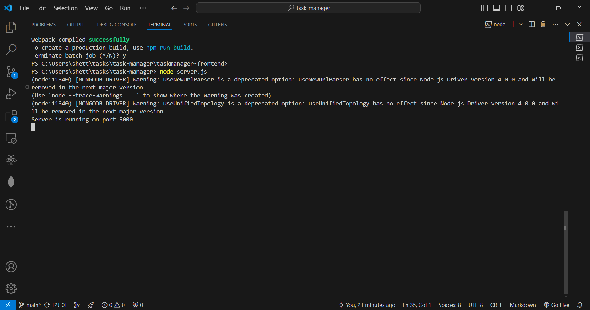
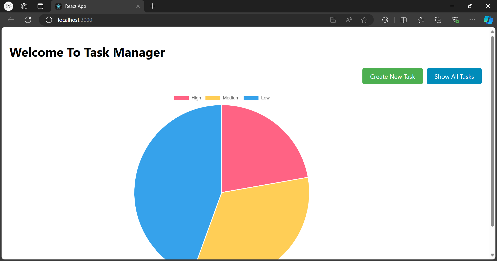
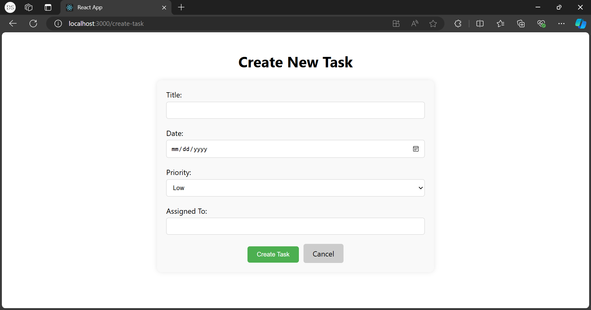
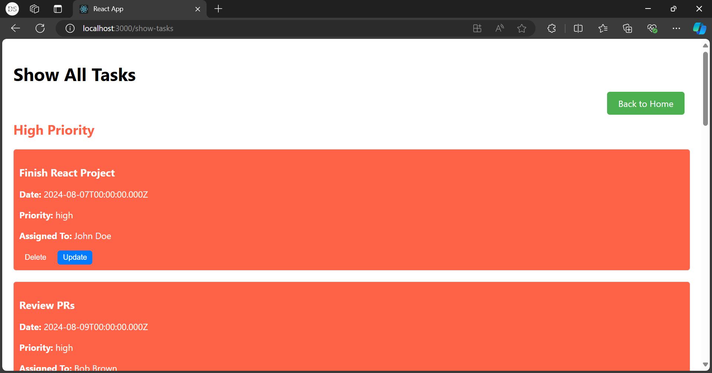
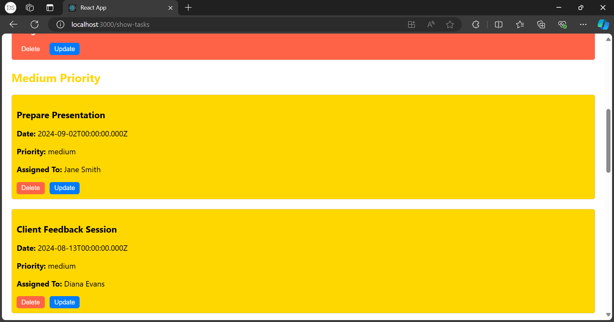
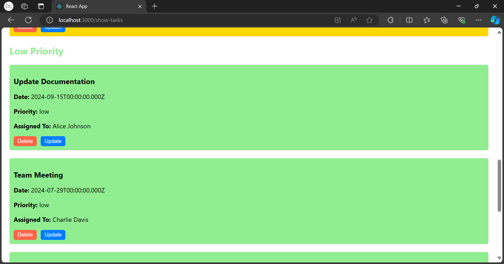

#Task Manager

## Table of Contents

- [Project Description](#project-description)
- [Technologies Used](#technologies-used)
- [Installation](#installation)
- [Usage](#usage)
- [Data](#data)
- [Model Training](#model-training)
- [Contributing](#contributing)
- [License](#license)
- [Acknowledgements](#acknowledgements)

## Project Description

The Task Manager application is a comprehensive solution for managing tasks with features to create, view, update, and delete tasks. The application provides a user-friendly interface with graphical representations of task distributions by priority. Users can easily navigate through different functionalities, ensuring efficient task management.

## Technologies Used

- **Frontend**: React, Chart.js & react-chartjs-2, CSS for styling
- **Backend**: Node.js, Express, MongoDB
- **Other**: Axios for API calls

## Installation

To run this project locally, follow these steps:

*Features*

Create new tasks with details such as title, date, priority, and assignee.
View all tasks grouped by priority.
Update and delete tasks.
Graphical representation of task priorities on the homepage.

# Prerequisites

- **Node.js and npm installed on your machine**
- **MongoDB installed and running locally or a MongoDB Atlas account**

# Setup

1. **Clone the repository**:
    ```sh
    git clone https://github.com/shettydevika/task-manager.git
    cd taskmanager

2. **Start MongoDB**:
Ensure MongoDB is running on your local machine.
    
3. **Run the backend server**:
    ```sh        
    node server.js

The backend server should now be running on http://localhost:5000.


4. **Navigate to the frontend directory**:
    ```sh
    cd taskmanager-frontend

5. **Start the frontend development server**:
   ```sh
   npm start

The frontend should now be running on http://localhost:3000.

## Usage

Homepage Overview

The main dashboard displaying task priorities and navigation buttons.

Create New Task
To create a new task, navigate to the "Create New Task" page using the button on the homepage. Fill in the required fields including title, date, priority, and assignee.

View Tasks by Priority
Tasks are displayed based on their priority on the "Show All Tasks" page. Each priority level is color-coded for easy identification.

Update and Delete Tasks
On the "Show All Tasks" page, you can update or delete tasks using the respective buttons.

/*Additional Information*/

-> Ensure that the backend server is running before starting the frontend development server.
-> MongoDB should be running on your local machine or adjust the MongoDB connection string in server.js accordingly.

----------------------------------------------------------------------------------

/*Troubleshooting*/

Dependencies not found or version issues

Make sure you have installed the correct versions of react-chartjs-2 and chart.js:

    npm install react-chartjs-2@3 chart.js@3

----------------------------------------------------------------------------------

Homepage Overview



This screenshot shows the main dashboard of the Task Manager application, including the bar graph representing task priorities and navigation buttons.

----------------------------------------------------------------------------------

Create New Task Form



This screenshot displays the form used to create a new task, including fields for title, date, priority, assigned to, etc.

----------------------------------------------------------------------------------
Tasks by Priority





This screenshot highlights the "Show All Tasks" page where tasks are grouped and displayed based on their priority levels.

----------------------------------------------------------------------------------
